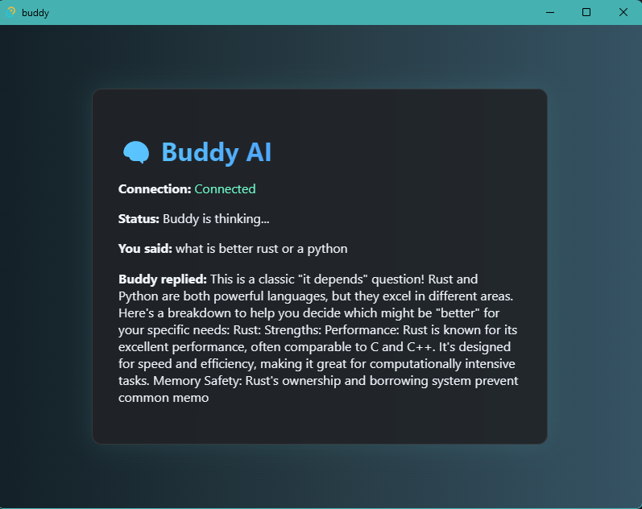

# Buddy: Your AI-Powered Desktop Companion (v 1.0)

Welcome to **Buddy**, a smart, voice-activated AI assistant for your desktop. Designed to blend **premium UI aesthetics** with cutting-edge **voice recognition** and **natural language processing**, Buddy is your always-ready companion, capable of real-time conversations, personalized greetings, and intelligent responses to your commands.

> "Hey Buddy..." and your AI assistant awakens to serve.

---

## 🤖 A look at our Buddy



## 🎯 Key Features

- **Passive Wake Word Detection**

  - Buddy passively listens for the wake word "Buddy" using Vosk's offline speech recognition engine.
  - Whispered or shouted, it knows when you're calling.

- **Voice-to-Voice Conversational AI**

  - Converts your voice to text.
  - Uses **Google's Gemini API** to generate intelligent, natural-sounding responses.
  - Speaks back to you using realistic text-to-speech (TTS).

- **Tauri-Powered Cross-Platform Desktop App**

  - Built using **Tauri + React + TypeScript**, this assistant runs natively on Windows.
  - Lightweight and secure with Rust-powered backend.

- **Interactive Frontend UI**

  - Clean dark theme with waveform-inspired animation.
  - Real-time status indicators (listening, thinking, speaking).
  - Logs your commands and Buddy's responses for transparent interaction.

- **Sleep and Reactivation Cycle**

  - After each interaction, Buddy returns to listening mode unless instructed otherwise.
  - Future support for a sleep-mode command ("Go to sleep, Buddy") is planned.

---

## 🧩 Tech Stack

| Layer         | Tech                             |
| ------------- | -------------------------------- |
| Frontend      | React + TypeScript + Vite        |
| Backend Core  | Tauri (Rust)                     |
| AI Engine     | Google Gemini API (NLP)          |
| Speech Input  | Vosk (offline voice recognition) |
| Speech Output | pyttsx3 (text-to-speech engine)  |

---

## 🚀 Getting Started

### Prerequisites

- [Python 3.10+](https://www.python.org/downloads/)
- [Rust & Cargo](https://www.rust-lang.org/tools/install)
- [Node.js & npm](https://nodejs.org/)
- Tauri CLI: `cargo install tauri-cli`

### Installation

```bash
# Clone the repo
$ git clone https://github.com/WaxifAlee/buddy.git
$ cd buddy

# Install frontend dependencies
$ npm install

# Install Python dependencies
$ pip install -r requirements.txt

# Download Vosk model
$ mkdir -p voice && cd voice
$ wget https://alphacephei.com/vosk/models/vosk-model-small-en-us-0.15.zip
$ unzip vosk-model-small-en-us-0.15.zip
```

### Run in Development

```bash
# Start the desktop app
$ npm run tauri dev
```

---

## 📂 Folder Structure

```bash
buddy/
├── src/                    # Frontend React app
├── src-tauri/              # Tauri backend (Rust)
├── scripts/                # Python scripts (wake listener, NLP handler)
├── voice/                  # Vosk model directory
├── tts/                    # Text-to-speech module
├── gemini/                 # Gemini NLP API integration
└── helpers/                # Common utility functions
```

---

## 🛠️ Features in Development

- [ ] Natural Sleep Mode & Wake Mode switching
- [ ] Enhanced UI with waveform visualizer
- [ ] Memory-based contextual follow-up
- [ ] Integration with OS-level controls (volume, browser, etc.)
- [ ] Configurable personality and response tone

---

---

## 👨‍💻 Author

**Wasif Ali**
Team Lead @ Zolvat | AI, FinTech & Development Enthusiast
[LinkedIn](https://www.linkedin.com/in/wasifali) | [GitHub](https://github.com/wasifali)

---

## 📜 License

MIT License. Use, modify, and build upon it freely. Just don’t forget to credit Buddy for the vibes.

---

> "Hey Buddy, show them what elite looks like."
